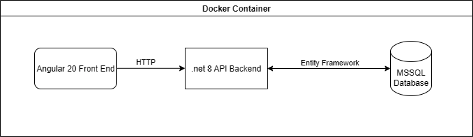

# RecipeShare
Welcome to RecipeShare, a vibrant community where home cooks and food bloggers discover, create, and share delicious recipes. we use a RESTful API backed by a mssql database, along with a lightweight angular UI that lets users manage recipes.

## Setup

This project includes a .NET 8 API backend, an Angular 20 frontend, and a MSSQL database running in Docker. You can get the entire stack running using Docker Compose.

### Prerequisites
- [Docker](https://www.docker.com/get-started) installed
- [Docker Compose](https://docs.docker.com/compose/install/) installed

### What will be running
- mssql/server:2025-latest
- recipeshare-api:latest
- recipeshare-frontend:latest

### Running the Application
1. Clone the repository:
    ```
   git clone git@github.com:BRRobinson/RecipeShare.git
   cd your-repo
   ```
2. Build and start all services:
    ```
    docker compose up --build
    ```
3. Connect to the Backend and run DBSync
    ```
    API backend: http://localhost:8080
    Run DbSync to setup Database
    http://localhost:8080/database/dbsync
4. Start using the front end 
    ```
    Angular frontend: http://localhost:4200
    ```

5. To stop the application:
    ```
    docker compose down
    ```

## Rationale

While the technology stack (.NET, Angular, and MSSQL) was provided as a requirement, several design choices were made during implementation to ensure maintainability, scalability, and :

- **Dependency Injection in .NET Backend**  
  I used dependency injection to keep the code modular. This makes it easier to swap out things like logging, database access, or services without breaking other parts of the application.

- **Angular Material in Frontend**  
  I chose Angular Material to provide a consistent and responsive UI. That is integrated well with Angular Framework.

- **Return Result Model**  
  I like using a return result model because it makes it clear whether a process was successful or not, and it can also carry extra information when needed. This way, at a glance, I can see both the outcome and any details that need to be communicated.

- **Postman**  
  I like using Postman for API calls because it gives me fine control when testing endpoints, and it also makes it easy to share and collaborate with the team through collections and environments.

These choices were made to keep the project clean, reusable, and ready to scale, while also making development smoother for anyone working on it.

### Architecture Diagram


### Benchmark
500 sequential calls to the Get all Recipes endpoint
