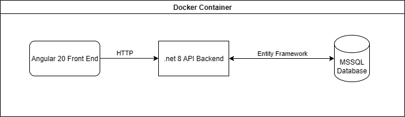

# Solution Overview

## Architecture

The solution is built as a containerized system with three main components:

- **Angular 20 Frontend**  

- **.NET 8 API Backend**  

- **MSSQL Database (Dockerized)**  

### Architecture Diagram

## Trade-offs

- **Dockerized MSSQL**  
  - *Pros:* Easy to spin up locally, consistent for all developers, reproducible.  
  - *Cons:* Not high availability; would need migration to a managed service in production or to work with a team.  

- **Angular Material**  
  - *Pros:* Consistent design, built-in accessibility.  
  - *Cons:* Does not come with much styling.  

- **.NET Backend with Dependency Injection**  
  - *Pros:* Clean architecture, testability, easier to extend.  
  - *Cons:* Slightly more upfront complexity for smaller projects.  

---

## Security Notes

- **API**
  - Needs JWT or OAuth2 for authentication/authorization.
  - Store credentials in environment variables, not in source control.

---

## Monitoring & Observability

- **Logging**
  - Centralize logs using tools like Serilog.
  - Standardize log formats.

- **Metrics**
  - Monitor API performance on more endpoints.
  - Use monitoring tools like Prometheus.

---

## Cost Strategies
Costs are kept low by running services locally with Docker during early development, and scaling resources in production or with larger teams and projects only when necessary. The focus is on avoiding waste and keeping environments lean..